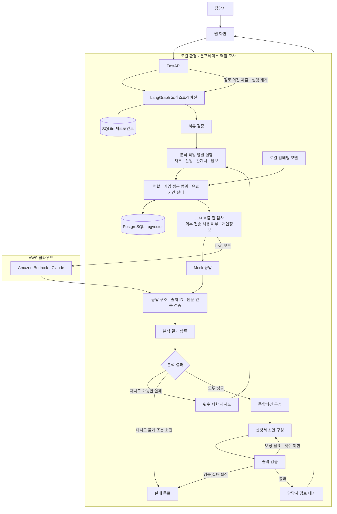

# Bedrock 기반 기업여신 심사지원 PoC

기업여신 심사지원 프로젝트를 위한 학습 및 포트폴리오입니다.
로컬 환경에서 문서를 검색하고, AWS Bedrock의 Claude로 분석한 후,
담당자가 근거와 초안을 확인하고 수정하는 흐름을 구현했습니다.

실제 금융기관 데이터 대신 합성 데이터와 예시 정책을 사용합니다.

## 주요 기능

- AWS Bedrock Converse API 연동 및 구조화된 응답 검증
- 개인정보 대체 식별자 치환·복원과 외부 전송 전 검사 실습
- 로컬 임베딩 및 PostgreSQL·pgvector 기반 RAG
- 사용자별 기업 접근 범위와 문서 유효기간에 따른 검색 제한
- 외부 전송이 금지된 검색 문서의 모델 호출 차단
- 출처 ID 및 원문 인용 문자열 검증
- LangGraph 기반 분석 작업 분기·합류와 제한적인 재시도
- SQLite 체크포인트 기반 담당자 검토 대기·재개
- FastAPI 웹 화면에서 분석 근거 확인, 의견 수정 및 검토 결과 저장

## 전체 아키텍처

로컬 환경이 온프레미스 역할을 수행하고,
Live 모드에서는 AWS Bedrock으로 분석을 요청합니다.



- 네 가지 분석 작업에 RAG와 LLM을 적용합니다.
- 재시도는 실패한 분석 작업만 대상으로 하며, 횟수를 제한합니다.
- 종합의견과 초안 구성에는 현재 규칙·템플릿을 사용합니다.
- 출력 검증은 코드에서 `precheck`라는 이름으로 구현되어 있습니다.
- 담당자는 웹 화면에서 의견을 수정하고 검토 결과를 저장합니다.
- HANF 직접 연동과 실제 전용망 구성은 포함하지 않습니다.

### 별도 개인정보 치환·복원 실습

통합 분석 흐름과 별도로 다음 절차를 검증합니다.

1. 로컬에서 개인정보를 대체 식별자로 치환
2. 복원 매핑은 로컬 메모리에 보관
3. 외부 전송 전 개인정보 잔존 여부 검사
4. 모델 응답의 구조와 대체 식별자 유효성 검사
5. 요청 범위를 확인한 후 로컬에서 원래 값으로 복원

이 치환·복원 절차가 통합 RAG의 자유 형식 문서 전체에
자동 적용되는 것은 아닙니다.

## 현재 실행 흐름

1. 서류 검증
2. 재무·산업·관계사·담보 분석 작업의 병렬 실행
3. 분석 결과 확인 및 재시도 가능한 실패 작업 재실행
4. 종합의견 구성
5. 신청서 초안 구성
6. 초안 출력 검증
7. 담당자 검토 및 수정·확정 또는 반려

네 가지 분석 작업이 LLM을 사용하며, 서류 검증과 종합의견 구성,
초안 구성 및 출력 검증에는 규칙과 템플릿을 사용합니다.
모든 업무 노드가 독립적인 LLM Agent인 것은 아닙니다.

분석 작업은 그래프에서 병렬로 실행되지만, 현재 실습 설정에서는
Bedrock 동시 호출 수를 제한합니다.

코드의 `precheck`는 생성된 초안의 신청금액과 분석 완료 여부 등을
확인하는 **출력 검증**입니다. 분석 시작 전 상품 적격성 등을 판단하는
업무 사전 점검은 현재 구현 범위에 포함하지 않습니다.

## 보안 및 개인정보 처리 범위

개인정보 실습에서는 대표자명을 대체 식별자로 치환하고,
복원용 매핑을 로컬 메모리에 유지합니다.
외부 전송 전 원문 개인정보와 일부 개인정보 패턴을 검사합니다.

통합 RAG 흐름에서는 검색 범위 제한, 문서의 외부 전송 허용 여부,
요청·응답 검사 및 출처 검증을 수행합니다.

개인정보 치환·복원 실습과 통합 RAG는 구현 범위가 구분됩니다.
자유 형식 문서 전체를 자동으로 비식별 처리하는 기능까지
통합한 것은 아닙니다.

## 기술 구성

- Python, uv
- AWS Bedrock, Claude, boto3
- LangGraph, SQLite
- PostgreSQL, pgvector
- Sentence Transformers 로컬 임베딩
- FastAPI, HTML, JavaScript
- Docker Compose

## 실행 방법

프로젝트 루트에서 실행합니다.

### 의존성 설치

```bash
uv sync
```

로컬 `.env`에 Bedrock 인증 정보와 PostgreSQL 접속 정보를 설정합니다.
`.env`와 실제 인증 정보는 Git에 포함하지 않습니다.

### PostgreSQL 시작

```bash
docker compose -f compose.pgvector.yml up -d
```

### 최초 데이터 준비

```bash
uv run python step3b_pgvector_rag.py --init
uv run python step4b_integrated_agents.py --seed
```

### 웹 서버 실행

```bash
uv run uvicorn step5_api:app --host 127.0.0.1 --port 8010
```

브라우저에서 http://127.0.0.1:8010 에 접속합니다.

Mock 모드는 Bedrock 호출 없이 흐름을 확인하며,
Live 모드는 유효한 Bedrock 인증 정보가 필요합니다.
두 모드 모두 통합 RAG 실행에는 로컬 DB와 임베딩 모델이 필요합니다.

## 검증

```bash
uv run python step6_evaluate.py
```

개인정보 전송 차단, 검색 범위 제한, 인용 검증,
그래프 분기·재시도, 검토 대기·재개 및 API 검토 요청을 평가합니다.
일부 테스트에는 실행 중인 PostgreSQL과 로컬 임베딩 모델이 필요합니다.

평가 보고서는 `outputs/evaluation/`에 생성됩니다.
자동 평가 통과가 실제 Claude 분석의 의미적 정확성이나
금융권 보안 적합성을 보장하지는 않습니다.

## 구현 한계

- 로컬 환경으로 온프레미스 역할을 모사하며 HANF와 직접 연동하지 않습니다.
- 실제 금융기관 인증·권한 시스템 및 전용 네트워크는 구현하지 않았습니다.
- 출처와 인용 문자열 검증은 문장의 의미적 타당성까지 판정하지 않습니다.
- 실제 서류 업로드·OCR 및 운영 수준의 개인정보 탐지는 포함하지 않습니다.
- 웹 화면은 로컬 실습용이며 운영 인증 체계가 없습니다.
- 담당자 검토 완료는 실제 여신 승인이나 대출 실행을 의미하지 않습니다.
- 104개 영업점 부하와 업무시간 480분→140분 단축은 검증하지 않았습니다.